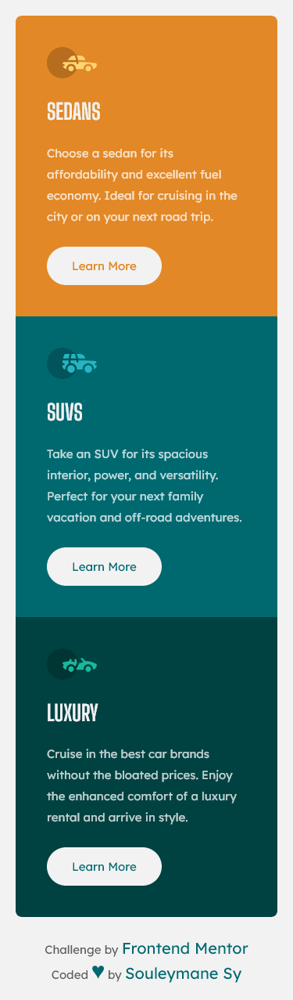
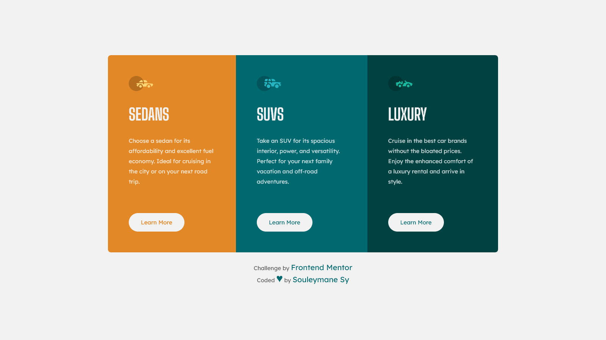

# Frontend Mentor - 3-column preview card component

## Welcome! 👋

Thanks for checking out this front-end coding challenge.

This is a solution to the [3-column preview card component challenge on Frontend Mentor](https://www.frontendmentor.io/challenges/3column-preview-card-component-pH92eAR2-).

[Frontend Mentor](https://www.frontendmentor.io) challenges help you improve your coding skills by building realistic projects.

## The challenge

The challenge is to build out this 3-column preview card component and get it looking as close to the design as possible.

Users should be able to:

- View the optimal layout depending on their device's screen size
- See hover states for interactive elements

## Screenshot

This is the Screenshot of my work!

### Mobile

### Desktops

### Links

- Solution URL: [solution URL here](https://www.frontendmentor.io/solutions/three-column-preview-card-responsive-html-sass-vite-LU427RkYlU)
- Live Site URL: [live site URL here](https://fem-three-column-preview-card.vercel.app/)

## My process

Made this projects with HTML5, SASS and Vite!

### Built with

- Semantic HTML5 markup
- SASS
- CSS custom properties
- Flexbox
- Mobile-first workflow
- Vite
- NPM

## Author

- GitHub - [Souleymane Sy](https://github.com/SouleymaneSy7)
- Frontend Mentor - [@SouleymaneSy7](https://www.frontendmentor.io/profile/SouleymaneSy7)
- Twitter - [@Souleymanesy43](https://twitter.com/Souleymanesy43)
